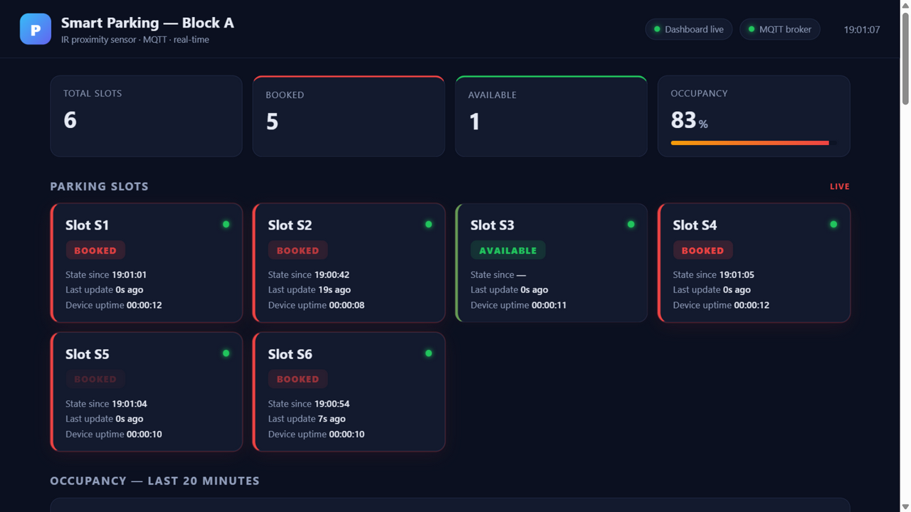
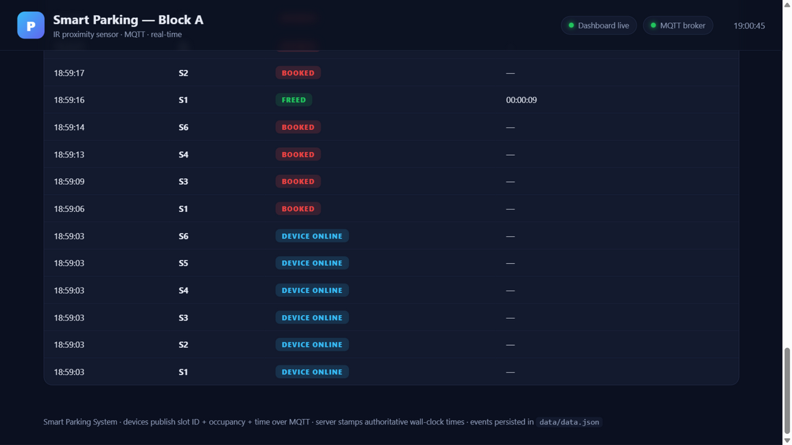

# Smart Parking System — IR sensor → MQTT → live web dashboard

[](https://github.com/YOUR_GITHUB_USERNAME/smart-parking-system/actions/workflows/ci.yml)
[](LICENSE)

An end-to-end parking-slot booking monitor. A hand placed over an **IR proximity
sensor** marks the slot **BOOKED**; removing it marks the slot **FREE**. Every
change — plus a periodic heartbeat — is published over **MQTT** to a central
server, which shows **slot ID, occupancy status and times** on a real-time web
dashboard and records a full event history.

| Live slots | Activity log |
|---|---|
|  |  |

```
┌────────────────────────────┐  MQTT (ESP32) / USB + bridge (Uno)  ┌─────────────────────────┐
│  IR sensor node (per slot) │ ──────────────────────────────────► │  Node.js central server │
│  Arduino Uno or ESP32      │  smartparking/demo01/slot/S1/       │  · embedded MQTT broker │
│  LED / buzzer / 16x2 LCD   │  status, /availability              │  · state + event log    │
└────────────────────────────┘                                     │  data/data.json         │
                                                              └───────────┬─────────────┘
                                            live updates (Socket.IO)      │ REST API
                                              ┌───────────────────────────┴──────┐
                                              │  Web dashboard  http://localhost:3000 │
                                              │  slot cards · stats · chart · log    │
                                              └──────────────────────────────────────┘
```

The server embeds its own **MQTT broker** (aedes) — no Mosquitto install needed.
To use an external broker instead, set `"embeddedBroker": false` in `config.json`.

---

## 1. Quick demo (no hardware, 2 minutes)

```bash
npm install
npm start          # terminal 1 — server + broker + dashboard on http://localhost:3000
npm run simulate   # terminal 2 — fake IR nodes booking/freeing slots
```

Open **http://localhost:3000**: slot **S1** books itself a few seconds after the
simulator starts; the other slots toggle randomly. To stop the simulator cleanly
 press `Ctrl+C` (it publishes `offline` for every device).

---

## 2. Hardware parts (per slot node)

| Part                                | Notes                                            |
|-------------------------------------|--------------------------------------------------|
| Arduino Uno (no shield needed)      | **Option A** — USB-serial mode via `serial-bridge.js` |
| ESP32 DevKit (or ESP8266 NodeMCU)   | **Option B** — Wi-Fi, talks MQTT directly (upgrade path) |
| IR proximity sensor (FC-51 / LM393) | 3-pin digital output, adjustable potentiometer   |
| LED + 220 Ω resistor                | onboard LED used by default                      |
| Active buzzer (optional)            | short beep when a hand is placed                 |
| 16x2 I2C LCD (optional)             | shows `S1 BOOKED` + live booking timer           |
| 5 V phone charger + Micro-USB cable | node power                                       |

### Wiring (ESP32)

| Signal            | ESP32 pin                          |
|-------------------|------------------------------------|
| IR sensor OUT     | **GPIO 13** (`IR_SENSOR_PIN`)      |
| IR sensor VCC     | 3V3 (or VIN/5V if the module needs it — OUT stays 3.3 V-safe on most modules powered at 3.3 V) |
| IR sensor GND     | GND                                |
| Buzzer (+)        | GPIO 26                            |
| LCD SDA / SCL     | GPIO 21 / GPIO 22                  |
| LED               | GPIO 2 (onboard)                   |

**How it reads "booked":** most 3-pin IR modules pull their output **LOW** when
an object is detected — that's `IR_ACTIVE_LOW 1` in `config.h`. If yours does the
opposite, set it to `0`. Adjust the module's potentiometer until the detection
LED fires at ~2–10 cm.

---

## 3. Firmware setup (Arduino IDE)

Two firmware variants are included — use the one for your board.

### Option A — Arduino Uno (no shield needed): USB-serial mode

The Uno can't speak MQTT by itself, so it streams the status JSON over its USB
cable, and **`serial-bridge.js`** on the PC republishes it to the broker as MQTT
— same topics, same payloads, so the server and dashboard behave exactly as if
the Uno were a wireless node.

1. **Wiring the HW-201:** `OUT → D2`, `VCC → 5V`, `GND → GND` (the Uno is
   5 V-tolerant, so the module can run at 5 V for best range). Optional: buzzer
   `+ → D8`, I2C LCD `SDA → A4`, `SCL → A5`.
2. Open **`firmware/smart_parking_uno_serial/smart_parking_uno_serial.ino`**,
   set `SLOT_ID` at the top of the file, select Board = *Arduino Uno*, upload.
3. Close the Arduino **Serial Monitor**, then start the bridge from the project
   folder (the server must be running):

   ```bash
   node serial-bridge.js                       # auto-detects the COM port
   node serial-bridge.js --port COM3 --slot S1 # explicit port
   ```

   (On this PC without a system Node: `tools\node\node.exe serial-bridge.js`.)
4. Hold a hand over the sensor → the slot flips to **BOOKED** on the dashboard;
   remove it → **FREE** with the session duration.

Notes: run **one bridge per Uno** (each Uno needs its own USB cable/port).
The bridge owns the COM port — stop it (Ctrl+C) before re-uploading a sketch.
If you later add an ESP32 or an Ethernet shield, no server/dashboard change is
needed.

### Option B — ESP32 / ESP8266 (wireless)

1. **Boards manager** → install *esp32 by Espressif Systems* (or *esp8266*).
2. **Library manager** → install **PubSubClient** (Nick O'Leary). For the LCD
   also install **LiquidCrystal_I2C** (Frank de Brabander).
3. Open `firmware/smart_parking_node.ino` — it `#include`s `config.h` (same folder).
4. Edit **`firmware/config.h`**:
   - `WIFI_SSID` / `WIFI_PASSWORD` — 2.4 GHz network only
   - `MQTT_HOST` — the LAN IPv4 of the PC running `server.js` (`ipconfig`)
   - `SLOT_ID` — unique per node: `S1`, `S2`, …
   - `ENABLE_LCD 1` only if you wired the LCD
5. Board = *ESP32 Dev Module*, flash, open Serial Monitor @ **115200**. Expected:

```
=== Smart Parking IR node ===
Slot id: S1 | prefix: smartparking/demo01
[WiFi] connected, IP 192.168.1.87
[MQTT] connected
[MQTT] smartparking/demo01/slot/S1/status {"slot":"S1","occupied":false,...} (sent)
[SENS] hand placed on sensor  ->  BOOKED
```

Hold your hand over the sensor: the dashboard flips the slot to **BOOKED** in
under half a second (300 ms debounce), the LED lights, the buzzer beeps and the
LCD runs a live booking timer.

---

## 4. MQTT interface (what the devices must send)

Prefix = `mqtt.prefix` from `config.json` (default `smartparking/demo01`).

| Topic                                | Payload / direction                                   | Retained |
|--------------------------------------|--------------------------------------------------------|----------|
| `PREFIX/slot/<ID>/status`            | device → server: `{"slot":"S1","occupied":true,"deviceTimeMs":123456,"seq":7}` | yes |
| `PREFIX/slot/<ID>/availability`      | device → server: `"online"` / `"offline"` (offline is the **Last-Will**, so a crashed node is marked offline automatically) | yes |
| `PREFIX/slot/<ID>/cmd`               | server → device: send `ping` to force a status publish | no |

`deviceTimeMs` is the device's uptime (proves liveness); **the server stamps the
authoritative wall-clock time** on every event — the dashboard's times and
session durations come from the server clock, so a clock-less ESP32 can't skew them.

Status is re-published every 30 s (`HEARTBEAT_MS`). Retained messages mean a
restarting server or dashboard instantly shows the current state.

Manual test with any MQTT client (e.g. `mosquitto_pub`):

```bash
mosquitto_pub -h 127.0.0.1 -t "smartparking/demo01/slot/S9/status" \
  -m '{"slot":"S9","occupied":true,"deviceTimeMs":1,"seq":1}' -r
```

> **Uno (Option A) note:** the MQTT client is `serial-bridge.js` on the PC, not
> the Uno — the Uno just sends the same JSON over USB. Everything below
> (topics, payloads, retained behaviour) is identical for both options.

---

## 5. Dashboard & API

**Dashboard** (`http://localhost:3000`):
- header pills: dashboard ↔ server link and server ↔ **MQTT broker** link
- stat cards: total / booked / available / occupancy % with bar
- a card per slot: **BOOKED / AVAILABLE**, device-online dot, state-since time,
  last update, device uptime — cards appear automatically as devices check in
- live 20-minute occupancy chart and a scrolling event log
  (`booked / freed / device online / device offline` with session durations)

**REST API** (for integration or a second frontend):

| Endpoint             | Returns                                        |
|----------------------|------------------------------------------------|
| `GET /api/slots`     | current state of every slot                     |
| `GET /api/stats`     | totals, booked, free, occupancy rate            |
| `GET /api/events?limit=100` | event history, newest first              |
| `GET /api/health`    | liveness probe                                  |

**Events** are persisted to `data/data.json` (last 500 by default,
`historyLimit` in `config.json`) and restored across restarts.

---

## 6. Adding more slots

- Simulator: `node simulator.js --slots 8`
- Hardware (ESP32): flash the same sketch on each board, changing only `SLOT_ID`
  (`S2`, `S3`, …). The dashboard and API pick new slots up automatically.
- Hardware (Uno): plug each Uno into its own USB port and run one
  `node serial-bridge.js --port COMx` per Uno.

## 7. Troubleshooting

| Symptom                                   | Fix                                                                 |
|-------------------------------------------|---------------------------------------------------------------------|
| `[WiFi] not connected`                    | 2.4 GHz network? SSID/password correct? Don't use captive-portal Wi-Fi |
| `[MQTT] failed, rc=-2`                    | Wrong `MQTT_HOST` (must be the server PC's LAN IP), or Windows Firewall blocking inbound **1883** — allow Node.js on private networks |
| Slot flips constantly                     | IR potentiometer mis-tuned / `IR_ACTIVE_LOW` wrong — see §2          |
| Sensor backwards (free = booked)          | Set `IR_ACTIVE_LOW 0` in `config.h`                                  |
| Dashboard shows device offline            | Node crashed or Wi-Fi dropped — Last-Will marked it; it self-heals on reconnect |
| LCD shows nothing / boxes                 | Run an I2C scanner; try `LCD_ADDR 0x3F`                              |
| Bridge: `could not auto-detect the Uno`   | Uno unplugged, or the port doesn't look Arduino-like — run `node serial-bridge.js --list` and pass `--port COMx` |
| Bridge: `serial error: Access denied`     | Another program holds the port (Arduino Serial Monitor, second bridge) — close it; the bridge retries every 5 s |
| Can't upload sketch from Arduino IDE      | The bridge owns the COM port — stop it with Ctrl+C, upload, restart it |

## 8. Project layout

```
server.js                    central server: broker + state + API + Socket.IO
simulator.js                 fake ESP32 nodes for demo/testing
serial-bridge.js             Uno USB-serial → MQTT bridge (Option A)
config.json                  ports, MQTT prefix, site name, history limit
public/                      dashboard (index.html, style.css, app.js)
firmware/smart_parking_uno_serial/   Arduino Uno sketch (USB mode)
firmware/smart_parking_node.ino      ESP32/ESP8266 sketch (Wi-Fi mode)
firmware/config.h            Wi-Fi / broker / slot-id / pins (edit this)
data/data.json               persisted slots + event history (auto-created)
tools/node/                  portable Node.js runtime (no system Node needed)
```

## 9. Publishing this project to GitHub

The repository is already initialized and committed. To put it on GitHub:

1. Create an **empty** repository on github.com (no README/license — this repo
   already has both). Say its URL is `https://github.com/USER/smart-parking-system.git`.
2. From the project folder:

   ```bash
   git remote add origin https://github.com/USER/smart-parking-system.git
   git push -u origin main
   ```

3. Edit the CI badge at the top of this README: replace `YOUR_GITHUB_USERNAME`
   with your GitHub username (2 places).

Later changes: `git add -A && git commit -m "describe the change" && git push`.

## License

[MIT](LICENSE) — free to use, modify and build upon, including for college and
commercial projects.
